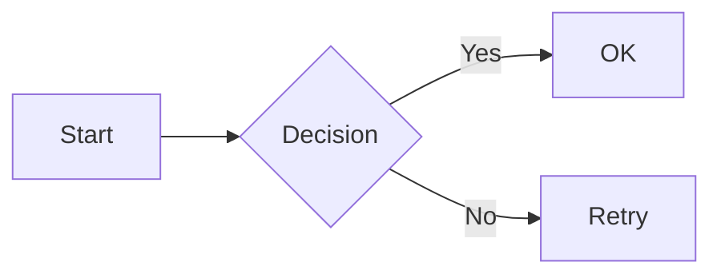
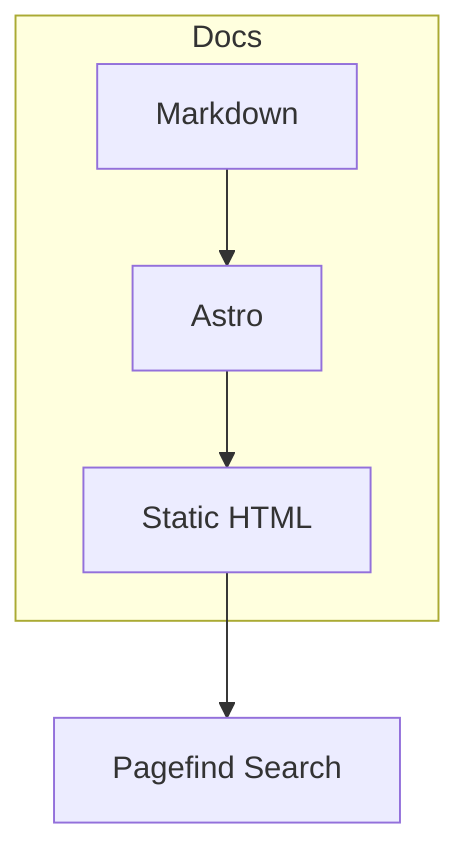

Echox renders [Mermaid](https://mermaid.js.org/) diagrams from fenced code blocks. Use the `mermaid` language identifier and write your diagram definition inside.

## Usage

````markdown

````

## Supported Diagram Types

Mermaid supports many diagram types. Common ones:

- **flowchart** / **graph** — Flowcharts and graphs
- **sequenceDiagram** — Sequence diagrams
- **classDiagram** — Class diagrams
- **stateDiagram** — State diagrams
- **erDiagram** — Entity-relationship diagrams
- **pie** — Pie charts
- **gantt** — Gantt charts

## Example



## Theme

Diagrams automatically follow your site theme (light/dark). When you toggle dark mode, Mermaid re-renders with the matching theme.

## Notes

- Diagrams are rendered client-side using Mermaid v11 from a CDN
- The copy button is not shown on Mermaid blocks (the diagram SVG is rendered instead of raw code)
- Diagrams are centered and scroll horizontally on small screens if needed
