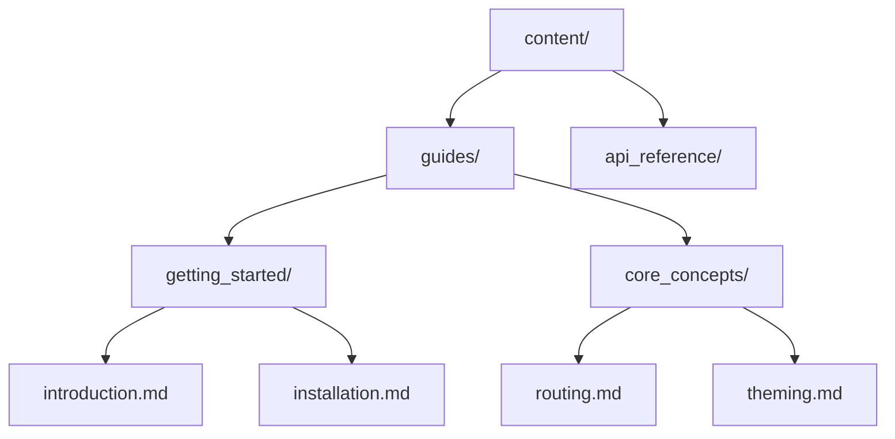

## Automatic Routing

Echox generates routes automatically from your folder structure. There is no routing configuration file — the filesystem is the source of truth.

Every `.md` file inside `content/` becomes a page. The URL is derived from the file path:

```
content/guides/getting_started/installation.md
→ /guides/getting_started/installation
```

## Navigation Hierarchy

The three-level folder structure creates the navigation:

1. **Tabs** — top-level folders appear as tabs in the header
2. **Groups** — second-level folders become sidebar section headings
3. **Pages** — markdown files are listed as links under their group



## Frontmatter

Each markdown file supports optional frontmatter:

```yaml
---
name: My Custom Title
order: 1
icon: star
---
```

| Field | Type | Default | Description |
|-------|------|---------|-------------|
| `name` | string | Filename, humanized | Display name in sidebar |
| `order` | number | Alphabetical | Sort position within group |
| `icon` | string | `file-01` | Hugeicons icon name for sidebar |

## Ordering

Pages are sorted by `order` first, then alphabetically by name. Groups and tabs follow the same rule.

> If you don't set `order`, pages will be sorted alphabetically. Set `order: 1`, `order: 2`, etc. to control the sequence.
